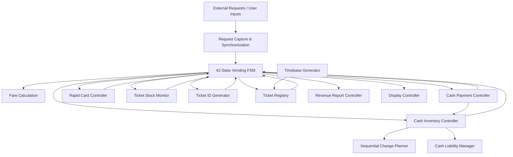

# Smart Ticket Vending Machine | SystemVerilog RTL Design

A modular SystemVerilog implementation of a **Smart Ticket Vending Machine** with cash and stored-value card payment, ticket generation and validation, cash inventory management, automatic change planning, refund and compensation handling, ticket-stock monitoring, revenue accounting, timeout recovery, and asynchronous request capture.

The design is structured as a collection of cooperating RTL modules integrated by the `smart_ticket_vending_top` module and coordinated by a multi-state transaction controller.

---

## 📌 Project Overview

This project models a feature-rich digital ticket vending system at the RTL level.

The system supports:

- Station-based fare calculation
- Cash payment
- Stored-value rapid-card payment
- Card loading and recharge
- Cash-note validation
- Cash escrow handling
- Automatic change calculation
- Cash recycler and collection-box management
- Refund processing
- Compensation processing after transaction failures
- Physical ticket issuance
- QR/digital ticket fallback
- Unique ticket-ID generation
- Ticket registration and reservation
- Ticket expiration
- Gate validation
- Prevention of ticket reuse
- Destination-station checking
- Paper and card stock monitoring
- Revenue and transaction accounting
- Payment and internal operation timeouts
- Maintenance recovery
- Closing/report mode
- Asynchronous request capture and acknowledgements
- Status-code generation for a display interface

---

# 🏗️ High-Level Architecture



The top-level module integrates the individual subsystems and manages the interaction between payment, ticketing, inventory, validation, accounting, and recovery logic.

---

# 📂 RTL Module Structure

The design contains the following major modules:

| Module | Purpose |
|---|---|
| `cdc_request_capture` | Captures asynchronous request signals and associated payloads using synchronization, stability checking, acknowledgement, and event generation |
| `level_synchronizer` | Two-stage synchronization of a single asynchronous level signal |
| `fare_calculation` | Calculates travel distance and fare from source and destination stations |
| `timebase_generator` | Produces periodic timing ticks used by time-dependent logic |
| `payment_controller` | Processes cash notes, validates supported denominations, tracks payment, detects rejected notes, and calculates change |
| `sequential_change_planner` | Determines an available combination of denominations for an exact requested amount |
| `cash_inventory_controller` | Manages escrow, recycler inventory, collection boxes, change dispensing, refunds, and compensation |
| `cash_liability_manager` | Tracks committed cash that may need to be returned after a transaction failure |
| `ticket_stock_monitor` | Manages paper-ticket and card stock and supports QR fallback |
| `ticket_id_generator` | Generates unique sequential ticket identifiers |
| `ticket_registry` | Reserves, stores, expires, validates, and marks tickets as used |
| `rapid_card_controller` | Implements stored-value card loading, fare debit, recharge, refund, and card-liability tracking |
| `revenue_report_controller` | Maintains cumulative revenue, cash, refunds, change, recharge, and ticket statistics |
| `vending_fsm` | Main transaction and recovery controller |
| `display_controller` | Converts internal conditions and FSM states into external display status codes |
| `smart_ticket_vending_top` | Top-level integration module |

---

# 🚉 Fare Calculation

The default configuration supports:

```text
Number of stations : 10
Base fare          : 20
Per-station fare   : 5
```

Travel distance is calculated as:

```text
distance = |destination_station - source_station|
```

The fare is then calculated as:

```text
fare = BASE_FARE + distance × PER_STATION_FARE
```

With the default parameters:

```text
fare = 20 + distance × 5
```

A route is valid only when:

- Both station numbers are within the configured station range
- Source and destination stations are different

Invalid routes produce a fare of zero.

---

# 💵 Cash Payment System

The cash-payment controller supports the following note denominations:

| Note Value | Supported |
|---:|:---:|
| 10 | ✅ |
| 20 | ✅ |
| 50 | ✅ |
| 100 | ✅ |
| 200 | ✅ |
| 500 | ✅ |

Unsupported or sensor-invalid notes are rejected.

The controller tracks:

- Total amount inserted
- Payment completion
- Required change
- Accepted-note events
- Invalid-note detection
- Storage rejection
- Rejected-note count
- Fake/invalid note indication

Payment succeeds when:

```text
paid_amount >= fare_amount
```

and the fare is non-zero.

Change is:

```text
change_amount = paid_amount - fare_amount
```

---

# 🏦 Cash Escrow & Inventory

Accepted notes are initially held in an **escrow** rather than immediately becoming permanent machine inventory.

This enables safer transaction handling because the money can still be returned if the transaction fails before completion.

The cash inventory supports:

```text
5-value coins
10-value notes
20-value notes
50-value notes
100-value notes
200-value notes
500-value notes
```

Default starting inventory:

| Denomination | Initial Quantity |
|---:|---:|
| 5 | 100 |
| 10 | 20 |
| 20 | 20 |
| 50 | 10 |
| 100 | 10 |
| 200 | 5 |
| 500 | 2 |

---

## Recycler Organization

The RTL groups stored notes into three recycler groups:

```text
Recycler 1 → 50 + 100
Recycler 2 → 10 + 20
Recycler 3 → 200 + 500
```

Default recycler capacity:

```text
60 notes per recycler group
```

Overflow is directed toward two collection boxes.

Default collection-box configuration:

```text
Collection Box 1 Capacity = 500
Collection Box 2 Capacity = 500
Safe Warning Threshold    = 400
```

The design exposes:

- Recycler counts
- Recycler-full flags
- Collection-box counts
- Collection-safe warning
- Collection-full indication
- Inventory count for every denomination

---

# 🧮 Automatic Change Planner

Change is not calculated using a simple greedy algorithm.

The design contains a sequential bounded change planner that searches for a valid combination using the denominations currently available in machine inventory.

Supported change denominations are:

```text
500
200
100
50
20
10
5
```

The planner tracks reachable amounts and stores predecessor information so that a successful solution can be reconstructed into exact denomination counts.

Conceptually:

```text
Requested Change
       ↓
Read Available Inventory
       ↓
Search Reachable Amounts
       ↓
Exact Amount Found?
   ┌───────┴───────┐
  Yes              No
   ↓                ↓
Reconstruct      Report
Denominations    Failure
   ↓
Dispense Change
```

The default maximum planned change is:

```text
MAX_CHANGE = 500
```

Only requested amounts divisible by `5` can be represented by the planner.

---

# 🛡️ Financial Recovery & Compensation

The design does more than simply dispense change.

It maintains financial-liability information so that if a failure occurs after money has been committed, the controller can attempt to restore the customer's funds.

The recovery architecture includes:

- Cash escrow refund
- Rapid-card rollback
- Cash liability tracking
- Compensation planning
- Compensation dispensing
- Service-required state
- Manual maintenance settlement

The default maximum compensation amount is:

```text
MAX_COMPENSATION = 500
```

This allows the FSM to distinguish between failures that can be automatically recovered and failures that require service intervention.

---

# 💳 Rapid Stored-Value Card System

The design contains a dedicated stored-value card subsystem.

Default configuration:

```text
CARD_SLOTS    = 16
CARD_ID_WIDTH = 8 bits
```

The controller supports:

- Loading an existing card
- Registering a new card
- Maintaining stored card balances
- Selecting an active card
- Card-tap payment
- Fare debit
- Wrong-card detection
- Card-not-loaded detection
- Insufficient-balance detection
- Refund after failed transactions
- Card recharge
- Recharge overflow checking
- Rapid-payment liability tracking

---

## Rapid Payment Flow

```text
Load Card
    ↓
Start Transaction
    ↓
Calculate Fare
    ↓
Tap Card
    ↓
Check Card ID
    ↓
Check Balance
    ↓
Debit Fare
    ↓
Create Refund Liability
    ↓
Issue & Register Ticket
    ↓
Complete Sale
    ↓
Clear Liability
```

If the ticketing transaction later fails, the debited amount can be credited back to the appropriate card.

---

# 🔋 Card Recharge

The machine also supports stored-value card recharge.

A recharge request contains:

```text
Card ID
Recharge Amount
```

Recharge succeeds only when:

- The requested card exists
- Recharge amount is non-zero
- The resulting 16-bit card balance does not overflow

The module produces dedicated:

```text
recharge_done
recharge_failed
```

status outputs.

---

# 🎫 Ticket Stock Management

The ticket-stock subsystem tracks:

- Physical paper-ticket stock
- Card stock
- Low-stock state
- Empty-stock state
- Ticket-device fault
- QR-only mode

Default configuration:

```text
Initial Paper Stock = 10
Initial Card Stock  = 5
Low-Stock Threshold = 3
QR Support          = Enabled
```

---

## Physical / Digital Fallback

The ticket issuing policy is:

```text
Ticket Requested
      ↓
Device Fault?
   ┌──┴──┐
  Yes    No
   ↓      ↓
 Fail   Paper Available?
          ┌──┴──┐
         Yes    No
          ↓      ↓
      Physical  QR Enabled?
       Ticket    ┌──┴──┐
                Yes    No
                 ↓      ↓
              Digital  Fail
               Ticket
```

Therefore, when paper stock becomes empty and QR support is enabled, the system can continue issuing digital tickets.

---

# 🆔 Ticket ID Generation

Each issued ticket receives a 32-bit sequential identifier.

The generator:

- Starts from ticket ID `1`
- Issues one ID per request
- Holds the generated ID valid while the request remains active
- Avoids generating ticket ID `0`
- Wraps from `32'hFFFF_FFFF` back to `1`

---

# 🗃️ Ticket Registry

The ticket registry stores active ticket information.

Default configuration:

```text
MAX_TICKETS         = 16
TICKET_EXPIRY_TICKS = 30
```

Each registered ticket contains:

```text
Ticket ID
Destination Station
Issue Time
Valid Flag
Used Flag
```

---

## Reservation Before Registration

A ticket-table slot is reserved before ticket generation proceeds.

This prevents starting a transaction that later discovers that no registry space is available.

The registry supports:

- Slot reservation
- Reservation release
- Ticket commit
- Automatic reuse of expired or used entries
- Active-ticket counting

---

# 🚪 Ticket Gate Validation

The validation subsystem checks a scanned ticket against the registry.

A gate opens only if the ticket:

```text
Exists
AND
Has not already been used
AND
Has not expired
AND
Matches the gate station
```

The design explicitly reports:

- `invalid_ticket`
- `already_used_ticket`
- `expired_ticket`
- `wrong_station_ticket`
- `gate_open`

Once successfully validated, the ticket is marked as used.

This prevents the same ticket from being reused.

---

# ⏱️ Ticket Expiration

The `timebase_generator` produces periodic `time_tick` pulses.

Default:

```text
CLOCKS_PER_TICK = 10
```

The ticket registry maintains an internal time counter based on these ticks.

A ticket expires when:

```text
current_time - issue_time >= TICKET_EXPIRY_TICKS
```

With the default configuration:

```text
TICKET_EXPIRY_TICKS = 30
```

---

# 🔄 Asynchronous Request Capture

External control requests are handled through the reusable:

```systemverilog
cdc_request_capture
```

module.

It provides:

- Request synchronization
- Payload sampling
- Configurable stability checking
- Pending indication
- Acknowledgement
- Single event pulse generation
- Request-release detection

The default stability requirement is:

```text
REQUEST_STABLE_CYCLES = 2
```

Requests using this mechanism include:

- Start
- Cancel
- Closing
- Maintenance clear
- Cash insertion
- Card loading
- Card tapping
- Recharge
- Card issue
- Ticket validation

A separate two-stage `level_synchronizer` is used for the ticket-device fault input.

---

# 🔐 Transaction Request Isolation

The top-level RTL maintains a transaction epoch for payment requests.

Cash and card-tap requests are associated with the active transaction so that a delayed request cannot accidentally be accepted by a later transaction.

The design tracks:

```text
transaction_epoch
cash_request_epoch
card_tap_request_epoch
```

along with request-context-valid flags.

This provides additional protection against stale payment events crossing transaction boundaries.

---

# 🧠 Main Transaction FSM

Transaction behavior is controlled by the `vending_fsm` module.

It contains **42 encoded states**, ranging from normal transaction processing to recovery and maintenance states.

Major state groups include:

### Normal Transaction

```text
IDLE
 ↓
CAPTURE_TRANSACTION
 ↓
CALCULATE_FARE
 ↓
WAIT_PAYMENT
 ↓
VERIFY_PAYMENT
 ↓
CHECK_STOCK
 ↓
RESERVE_TICKET
 ↓
CHANGE PLANNING (Cash Mode)
 ↓
GENERATE_ID
 ↓
COMMIT_CASH (Cash Mode)
 ↓
DISPENSE_CHANGE (Cash Mode)
 ↓
ISSUE_TICKET
 ↓
REGISTER_TICKET
 ↓
TRANSACTION_DONE
```

---

## Error & Recovery States

The FSM also contains dedicated states for:

- Invalid route
- Invalid/fake note
- Cash-storage rejection
- Low card balance
- Card not loaded
- Wrong card
- Ticket unavailable
- Ticket table full
- Change unavailable
- Refund processing
- Cash refund service
- Rapid-card rollback
- Compensation planning
- Compensation dispensing
- Payment timeout
- Internal operation timeout
- Service error
- Maintenance recovery

---

# ❌ Transaction Cancellation

Cancellation is allowed only during designated safe stages.

The FSM exposes:

```text
cancel_allowed
```

and prevents cancellation while certain payment requests or payment events are still in flight.

Depending on payment mode, cancellation can trigger:

```text
Cash mode  → Return escrow
Rapid mode → Restore debited card balance
```

---

# ⏳ Timeout Protection

The FSM includes multiple timeout mechanisms.

Default configuration:

| Timeout | Default Cycles |
|---|---:|
| Payment timeout | 500 |
| Internal operation timeout | 64 |
| Change planning timeout | 25,000 |
| Compensation planning timeout | 25,000 |

Payment activity resets the payment timeout counter.

Long-running internal operations use a separate timeout counter.

Timeout recovery depends on the operation that failed and whether customer funds are currently at risk.

---

# 🛠️ Service & Maintenance Recovery

When automatic recovery cannot safely complete, the FSM can enter:

```text
S_SERVICE_ERROR
```

and assert:

```text
service_required
```

A maintenance-clear request then moves the machine through a recovery state that can:

- Clear the active transaction
- Release reserved ticket slots
- Abort active planners
- Perform manual financial settlement
- Return the FSM to idle operation

---

# 📈 Revenue & Accounting

The `revenue_report_controller` maintains cumulative counters for:

```text
Total Revenue
Total Cash In
Total Change Returned
Total Refunded
Total Recharge Amount
Total Tickets Issued
```

The module uses saturating behavior for counters.

If an accounting value would overflow its supported range, it sets:

```text
accounting_overflow
```

and saturates the affected counter rather than allowing normal arithmetic wraparound.

---

# 🧾 Closing & Report Mode

A closing request can move the FSM through:

```text
CLOSING_MODE
      ↓
REVENUE_SUMMARY
      ↓
IDLE
```

The revenue-summary state asserts the report-generation request.

The top-level output:

```text
report_valid
```

indicates when the accounting report is active.

---

# 🖥️ Display Controller

The RTL contains a display abstraction that generates:

```text
display_status_code
display_value
```

Status codes represent conditions such as:

- Normal FSM state
- Payment accepted
- Change dispensed
- Low stock
- QR-only operation
- Invalid note
- Low balance
- Storage rejection
- Invalid route
- Ticket unavailable
- Refund
- Change unavailable
- Transaction abort
- Payment timeout
- Internal operation timeout
- Service required
- Compensation/recovery
- Recharge success/failure
- Revenue report
- Accounting overflow

This separates high-level machine status from the internal FSM implementation.

---

# 🔧 Important Default Parameters

| Parameter | Default |
|---|---:|
| `QR_ENABLED` | `1` |
| `CLOCKS_PER_TICK` | `10` |
| `TICKET_EXPIRY_TICKS` | `30` |
| `PAYMENT_TIMEOUT_CYCLES` | `500` |
| `INTERNAL_TIMEOUT_CYCLES` | `64` |
| `CHANGE_PLAN_TIMEOUT_CYCLES` | `25000` |
| `COMPENSATION_TIMEOUT_CYCLES` | `25000` |
| `MAX_CHANGE` | `500` |
| `MAX_COMPENSATION` | `500` |
| `REQUEST_STABLE_CYCLES` | `2` |
| `CARD_SLOTS` | `16` |
| `CARD_ID_WIDTH` | `8` |
| `MAX_TICKETS` | `16` |

---

# 🧪 RTL Assertions

Several modules include simulation-only parameter and consistency assertions using:

```systemverilog
`ifndef SYNTHESIS
```

Examples include checks for:

- Positive parameter values
- Valid station capacity
- Inventory-width limits
- Recycler-capacity constraints
- Collection-box constraints
- Change limits divisible by `5`
- Valid ticket-table size
- Valid card-slot configuration
- Non-zero generated ticket IDs

These checks help detect invalid configurations during simulation without becoming part of synthesized hardware.

---

# 🔄 Complete Cash Transaction Flow

```text
Start Request
     ↓
Capture Source / Destination
     ↓
Calculate Fare
     ↓
Accept Cash Notes
     ↓
Validate Notes
     ↓
Payment Complete
     ↓
Check Ticket Availability
     ↓
Reserve Registry Slot
     ↓
Plan Required Change
     ↓
Generate Ticket ID
     ↓
Commit Escrow to Inventory
     ↓
Dispense Change
     ↓
Issue Physical / Digital Ticket
     ↓
Register Ticket
     ↓
Complete Sale
     ↓
Update Accounting
```

If a critical operation fails after cash has been committed, the FSM can move into compensation or service-recovery logic.

---

# 💳 Complete Rapid-Card Transaction Flow

```text
Load / Select Card
       ↓
Start Transaction
       ↓
Calculate Fare
       ↓
Tap Card
       ↓
Verify Card ID
       ↓
Check Available Balance
       ↓
Debit Fare
       ↓
Create Rapid Liability
       ↓
Check Ticket Availability
       ↓
Reserve Registry Slot
       ↓
Generate Ticket ID
       ↓
Issue Ticket
       ↓
Register Ticket
       ↓
Complete Sale
       ↓
Clear Rapid Liability
```

If ticket generation or registration fails after the card has been debited, the rapid rollback mechanism can restore the charged amount.

---

# 🎯 Design Highlights

This project demonstrates practical RTL implementation of:

- Modular SystemVerilog architecture
- Multi-module system integration
- Large finite-state-machine design
- Parameterized RTL
- Asynchronous request synchronization
- Request/acknowledgement handshakes
- Transaction context isolation
- Datapath and control separation
- Cash-payment processing
- Stored-value payment processing
- Escrow-based transaction handling
- Bounded change planning
- Inventory and capacity management
- Financial liability tracking
- Automatic rollback and compensation
- Ticket reservation and registration
- Ticket expiry
- Single-use ticket validation
- Physical-to-digital ticket fallback
- Timeout and failure recovery
- Revenue accounting
- Saturating arithmetic
- Simulation-time assertions

---

# 💼 Portfolio Relevance

This repository is part of my **RTL, VLSI, digital design, and semiconductor engineering portfolio**.

It demonstrates experience with system-level RTL design beyond a simple FSM or standalone arithmetic block.

The project combines:

```text
Control Logic
+ Datapath Logic
+ Memory Structures
+ Resource Management
+ Payment Processing
+ Error Recovery
+ Timing Control
+ Transaction Safety
+ Hardware-Oriented System Integration
```

Relevant areas include:

- RTL Design
- ASIC Front-End Design
- FPGA Design
- Digital System Design
- SystemVerilog
- Functional Verification
- FSM Design
- Hardware Architecture

---

# 📂 Repository Files

```text
smart-ticket-vending-machine/
│
├── smart_ticket_vending_simulation_fixed_v6_wave.sv
│   └── Main SystemVerilog RTL implementation
│
├── tb_smart_ticket_vending_fixed_v6_wave.sv
│   └── SystemVerilog testbench
│
├── LICENSE
│   └── Copyright and usage terms
│
└── README.md
    └── Project documentation
```

---

# ⚠️ Copyright and Usage

Copyright © 2026 Tanjim Ahmed. All Rights Reserved.

This project and all associated source-code files are publicly available solely for:

- Portfolio review
- Technical evaluation
- Educational viewing
- Professional recruitment evaluation

No permission is granted to copy, reproduce, modify, redistribute, publish, sublicense, sell, commercially use, submit as another person's academic work, or incorporate this source code into another project without prior written permission from the copyright owner.

Unauthorized reproduction, modification, redistribution, or reuse of this source code is prohibited.

For complete terms and conditions, see the [LICENSE](LICENSE) file.

---

# 👤 Author

**Tanjim Ahmed**

VLSI / RTL Design Enthusiast  
SystemVerilog • Digital Design • RTL Verification • ASIC Design

---

⭐ This repository is part of my ongoing VLSI and semiconductor engineering portfolio.
